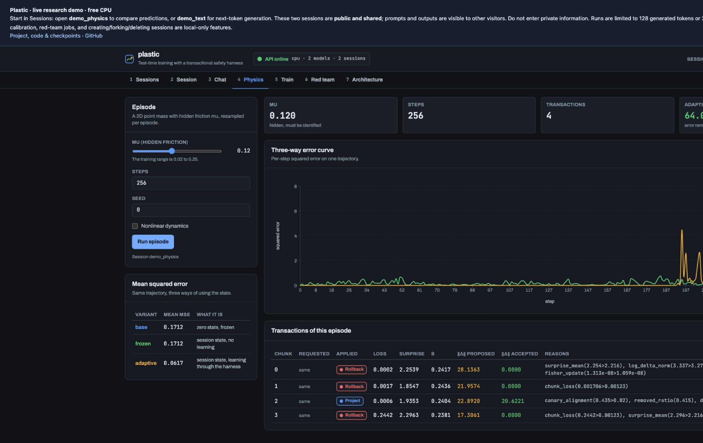

# Plastic

**Watch a small model learn from a sequence—and inspect what it keeps.**

Plastic is a research workbench for models with memory that changes during inference.
It combines a selective state-space recurrence, gradient-updated fast memory, and an
external harness that can accept, scale, project, or roll back a proposed memory update.
The same model core handles text prediction and a 2D physics task with hidden friction.

**[Open the live dashboard](https://huggingface.co/spaces/dmontgomery40/plastic)** ·
**[Browse all files on Hugging Face](https://huggingface.co/dmontgomery40/plastic/tree/main)** ·
**[Develop on GitHub](https://github.com/DMontgomery40/plastic)**



*The working CPU dashboard, shown locally. The charts show one interactive run, not the saved held-out evaluation below.*

## Start with the physics demo

1. Open the live dashboard and select **demo_physics** in the session picker.
2. Open **Physics**, choose friction and a seed, and click **Run episode**.
3. Compare base, frozen, and adaptive prediction errors on the same trajectory.
4. Open **Session** to inspect the proposed memory changes and what the harness accepted.

The model receives observations, actions, and a reset flag. It does not receive the
friction value you choose. A lower adaptive prediction error shows useful online
adaptation on that run; the transaction log tells you which updates were retained.

To try text, select **demo_text**, open **Chat**, and enter a short continuation prompt
such as `The history of computing`. This is a 6.85M-parameter next-token model trained
from scratch, so expect rough continuations rather than assistant-style answers.

The hosted demo has two **public, shared sessions**. Prompts and outputs are visible to other visitors; do not enter private information. Runs are bounded to keep the CPU demo responsive. Use the local project for private sessions, training, and larger experiments.

## What is in the project?

| Part | What you can do | Source |
| --- | --- | --- |
| Dashboard | Explore sessions, chat, physics, training curves, red-team reports, and architecture | [dashboard/](dashboard/) |
| Model | Study the recurrence, fast-weight updates, and shared text/physics core | [plastic/model/](plastic/model/) |
| Transaction harness | Inspect commit, rollback, projection, budgets, and canary probes | [plastic/harness/](plastic/harness/) |
| Training and evaluation | Train small models and compare memory-enabled and writes-disabled behavior | [plastic/train/](plastic/train/) |
| API and sessions | Drive the same experiments from Python, CLI, or HTTP | [plastic/api/](plastic/api/), [plastic/session/](plastic/session/) |
| Research record | Read derivations, corrections, evidence, and experimental proposals | [docs/research/](docs/research/) |
| Tests | Check state semantics, equivalence, persistence, and interface contracts | [tests/](tests/) |
| Public demo deployment | Run the bounded CPU demo or import checkpoints locally | [deploy/huggingface/](deploy/huggingface/) |

The Hugging Face **Files** tab contains this source snapshot plus both trained models:
[text/](https://huggingface.co/dmontgomery40/plastic/tree/main/text) and
[physics/](https://huggingface.co/dmontgomery40/plastic/tree/main/physics).
Each model includes weights, configuration, saved evaluation, training logs, harness
reference artifacts, a checksum manifest, and a loading example. GitHub holds the
ongoing development history. The linked Space runs the actual frontend and backend.

## Run everything locally, without training first

You need Python 3.12+, [uv](https://docs.astral.sh/uv/), and Node.js/npm.
Download the complete public repository (including the roughly 40 MB of checkpoints):

```bash
uv run --with huggingface_hub --no-project python -c "from huggingface_hub import snapshot_download; snapshot_download('dmontgomery40/plastic', local_dir='plastic')"
cd plastic
uv sync --extra dev
npm --prefix dashboard ci
uv run python -m deploy.huggingface.prepare --source . --artifacts-root artifacts
bash start.sh
```

Open [localhost:5173](http://localhost:5173). In **Sessions**, create a session with
`phys_mps_3k` or `lm_wikitext_l4`, then open Physics or Chat. Your local sessions stay in your own artifact store. Importing checkpoints does not retrain them.

Already working from GitHub? Download only the checkpoint folders before importing:

```bash
uv run python -c "from huggingface_hub import snapshot_download; snapshot_download('dmontgomery40/plastic', allow_patterns=['text/*', 'physics/*'], local_dir='artifacts/hub')"
uv run python -m deploy.huggingface.prepare --source artifacts/hub --artifacts-root artifacts
bash start.sh
```

The server defaults to CPU. For Apple MPS, run `DEVICE=mps bash start.sh`; use
`DEVICE=cuda` on a suitable NVIDIA setup. PyTorch >= 2.12 is required. The runtime
uses ordinary PyTorch, without custom Triton kernels.

For training, calibration, CLI sessions, red-team experiments, and the full research
contracts, see the [user guide](docs/user-guide.md). The [deployment guide](deploy/huggingface/README.md)
explains the public demo's limits and how to run it yourself.

## What the saved models demonstrate

| Checkpoint | Parameters | Saved held-out metric | Writes enabled | Writes disabled |
| --- | ---: | --- | ---: | ---: |
| Physics | 3.56M | Observation-delta MSE | 0.00012885 | 0.20873034 |
| Text | 6.85M | NLL, nats/token | 3.4704 | 5.0151 |

These are single-run evaluation records, covering 131,072 physics target elements
and 131,072 text tokens. Disabling writes uses `beta_scale=0`; retention still runs.
The figures support memory utility on these tasks. They are distinct from the
live dashboard's session comparisons, and NLL and MSE are different units.
The model folders' `eval.json` files contain the underlying measurements.

The implemented fast learner is a **linear delta-memory baseline with a normalized
readout**. The nonlinear [coordinate proposal](docs/research/2026-09-21-plastic-coordinate-recurrence.md)
is experimental and unintegrated. The current attack study does not establish
adversarial robustness. Rollback controls retained memory; it does not retract
emitted outputs or erase all activation influence. See the
[research briefing](docs/research/README.md) and [evidence report](docs/research/2026-09-22-trained-model-operating-point.md)
for the methods and limitations.

## Develop and verify

```bash
uv run pytest tests deploy/huggingface/test_space.py
npm --prefix dashboard test
npm --prefix dashboard run build
git diff --check
```

Read [AGENTS.md](AGENTS.md) before changing model or harness contracts. Generated
sessions, downloaded corpora, and local experiment artifacts are not automatically
published or backed up by a code push.

## License

The [license](LICENSE) permits noncommercial use under its stated conditions.
Commercial use requires prior written permission from the copyright holder.
